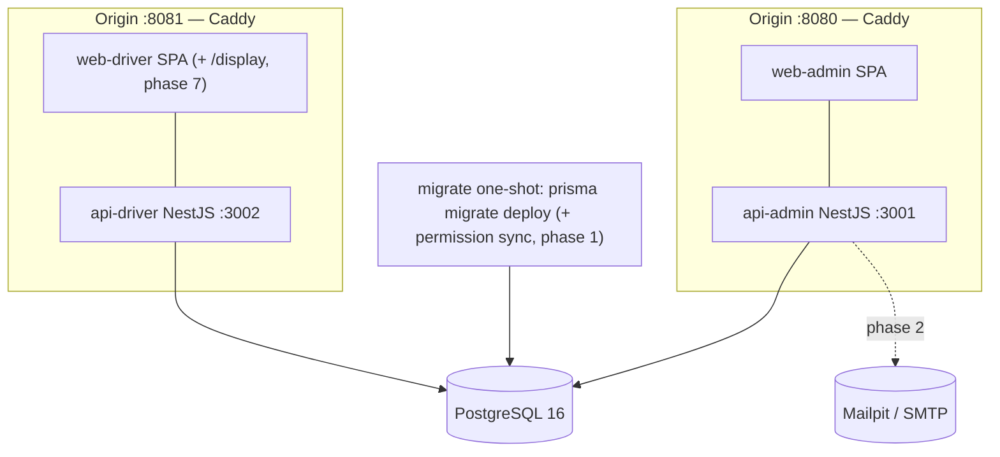

# Architecture

Maintained technical documentation. Business documentation lives in `README.md`; decisions in
`docs/adr/`. Sections marked "phase N" are filled when that phase lands.

## Context (C4 level 1)

## Containers (C4 level 2)

Two NestJS processes share `contracts`, `db`, `auth-core` and `domain` through workspace packages
(ADR-0001). Each SPA and its API sit behind one origin: Caddy in compose, Vite's dev proxy locally
(D11). Migrations run only in the one-shot `migrate` service or `predev`, never in an app (D12). In
production the kiosk origin runs on an isolated terminal network; the compose stack serves both
origins from one Caddy container on one Docker network.

## Dependency rule

`contracts <- db <- domain <- apps`; `auth-core` is Nest-free and Prisma-free. Enforced by
`eslint-plugin-boundaries` (`packages/config/eslint/base.mjs`). `api-driver` may import only
`@tms/domain/checkin` and `@tms/domain/shared` (`no-restricted-imports` in its eslint config).

## Environments

|            | Development                          | Compose `full` / production                         |
| ---------- | ------------------------------------ | --------------------------------------------------- |
| SPA        | Vite dev server :5173 / :5174        | static files served by Caddy                        |
| `/api`     | Vite `server.proxy` to :3001 / :3002 | Caddy `reverse_proxy` to the API container          |
| Database   | compose `postgres`                   | compose `postgres` (volume `pgdata`)                |
| Migrations | `pnpm dev` → `predev`                | `migrate` one-shot, apps wait for it                |
| Email      | Mailpit :8025                        | compose `full`: Mailpit · production: SMTP from env |

## Data model — phase 1 (ERD generated from `schema.prisma`)

## Authentication flows — phase 2 (sequence diagrams)

## RBAC and permission sync — phase 3a/3b

## Check-in and queue state machines — phase 4/5

## Observability — phase 1 (logs, Sentry, audit)

## Testing strategy

See spec section 13. Phase 0 provides: Jest (unit + supertest e2e-spec) per API, Vitest per SPA
and tooling package, Playwright smoke against the compose `full` profile, CI jobs `verify`,
`hygiene`, `db-drift`, `e2e`.
