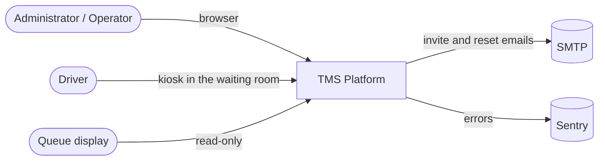
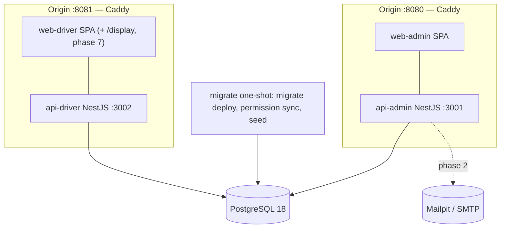
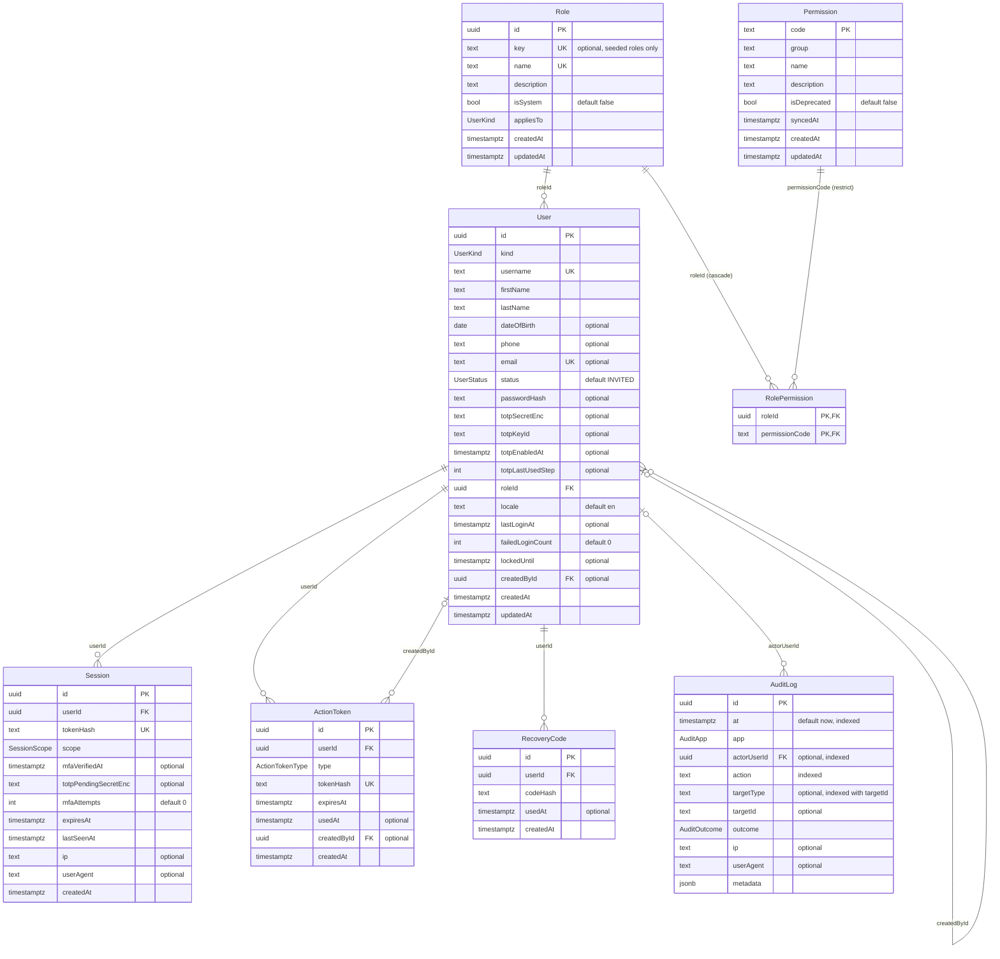
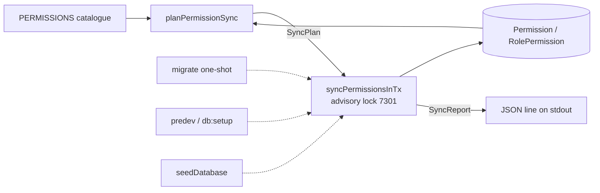

# Architecture

Maintained technical documentation. Business documentation lives in `README.md`; decisions in
`docs/adr/`. Sections marked "phase N" are filled when that phase lands.

## Context (C4 level 1)

## Containers (C4 level 2)

Two NestJS processes share `contracts`, `db`, `auth-core` and `domain` through workspace packages
(ADR-0001). Both APIs boot through `@tms/nest-bootstrap` (ADR-0008): a zod-validated environment
before Nest starts, the `/api` prefix, shutdown hooks and the pino logger, so each app is `main.ts`
plus its `AppModule`; they listen on `127.0.0.1` in development and on `0.0.0.0` in containers
(`HOST` overrides). Each SPA and its API sit behind one origin: Caddy in compose, Vite's dev proxy
locally (D11). Migrations run only in the one-shot `migrate` service or `predev`, never in an app
(D12). In production the kiosk origin runs on an isolated terminal network; the compose stack
serves both origins from one Caddy container on one Docker network.

## Dependency rule

`contracts <- db <- domain <- apps`, plus `contracts, db, logger <- bootstrap <- api` (`bootstrap`
is `packages/nest-bootstrap`, the shared Nest bootstrap). Apps are two element types: `api`
(`apps/api-*`) may import `contracts`, `db`, `auth-core`, `logger`, `domain` and `bootstrap`; `web`
(`apps/web-*`) only `contracts` and `ui`. Enforced by `eslint-plugin-boundaries`
(`packages/config/eslint/base.mjs`) for relative imports and `@tms/*` package specifiers alike:
`eslint-import-resolver-typescript` follows each package's `exports` and pnpm's symlinks to the
real file, so a forbidden import is reported however it is written, provided the imported
package's `dist/` has been built; an unresolved specifier is treated as external and passes
silently, which a fresh clone or a stale `dist/` can hit locally. The turbo `lint` task depends on
`^build`, and CI always builds first, so the gate holds there
(`packages/config/test/eslint-boundaries-packages.test.mjs`). `api-driver` may import only
`@tms/domain/checkin` and `@tms/domain/shared` (`no-restricted-imports` in its eslint config).
`auth-core` is Nest-free and Prisma-free by convention; boundaries stops it importing `db`/`domain`,
and direct `@nestjs/*`/`@prisma/*` imports get their own `no-restricted-imports` rule when the
package lands (phase 2) — boundaries does not check npm-package specifiers.

## Packages and module format

Nest-aware libraries (`db`, `logger`, `nest-bootstrap`, `domain`) compile to CommonJS
(`@tms/config/tsconfig/nest-library.json`) like the two apps, so dual-build dependencies such as
`nestjs-cls` and `@sentry/nestjs` load exactly once per process. `contracts` (and later `ui`) is
ESM (`library.json`, `.js` extensions on relative imports) because the Vite SPAs import it; the
CommonJS apps and libraries load it through Node's `require(esm)` (Node 22.12+, no top-level
`await` allowed in the package). Every package `exports` entry carries `types` + `default`, never
`import` only, so both module systems and TypeScript's `nodenext` resolution land on the same file;
subpaths (`./security`, `./audit`) are the only deep imports the exports map allows.
`auth-core` is CommonJS and tested with Jest like the other Nest-aware libraries, but imports no
workspace package, no Nest and no Prisma (its own `no-restricted-imports` rule plus
`purity.spec.ts`): it holds ports and pure algorithms, and `@tms/domain/admin` binds the adapters.

## Environments

|            | Development                                             | Compose `full` / production                              |
| ---------- | ------------------------------------------------------- | -------------------------------------------------------- |
| SPA        | Vite dev server :5173 / :5174                           | static files served by Caddy                             |
| `/api`     | Vite `server.proxy` to :3001 / :3002                    | Caddy `reverse_proxy` to the API container               |
| Database   | compose `postgres`                                      | compose `postgres` (volume `pgdata`)                     |
| Migrations | `pnpm dev` → `predev` (deploy, drift check, sync, seed) | `migrate` one-shot: deploy, sync, seed; apps wait for it |
| Logs       | stdout + `apps/api-*/logs/<app>/` (`LOG_DIR`)           | stdout + volume `logs` at `/var/log/tms/<app>/`          |
| Email      | Mailpit :8025                                           | compose `full`: Mailpit · production: SMTP from env      |

## Data model — phase 1 (ERD mirrors `schema.prisma`)

Source of truth: `packages/db/prisma/schema.prisma`; every schema change ships with exactly one
migration under `packages/db/prisma/migrations/` (D7) and the CI `db-drift` job proves the
migrations rebuild the schema. Conventions: Prisma's default names (PascalCase tables, camelCase
columns, no `@@map`); primary keys are UUID v7 generated by the client (`@default(uuid(7))`, so ids
are time-ordered); every point in time is `TIMESTAMPTZ(3)`, every calendar day is `DATE`
(`dateOfBirth`, `adrExpiresAt`, `plannedDate`, `QueueEntry.day`, `QueueDayCounter.day`).
Bookkeeping timestamps (`createdAt`, `updatedAt`, `AuditLog.at`) default in the database; business
timestamps (`expiresAt`, `lastSeenAt`, `syncedAt`, `issuedAt`, `pinUpdatedAt`, `checkedInAt`) are
set by the owning service through the `Clock` port. Foreign keys towards `User` and towards master
data are `ON DELETE RESTRICT` (D9: users are deactivated, never deleted, so audit rows keep their
actor; master data is deactivated with `isActive`); the only cascade is `Role → RolePermission`.
Enums are declared once in `@tms/contracts` (`DB_MIRRORED_ENUMS`) and mirrored in the schema;
`packages/db/test/enums-parity.spec.ts` asserts set equality per enum and that both name sets
coincide (14 enums).

### Identity, access and audit

### Drivers, master data and operations

`User` appears with its key only; its columns are in the diagram above. Queue position is never
stored: it is derived at read time (`ORDER BY checkedInAt, id` over WAITING/CALLED entries, section
10). `activeOrderId` equals `orderId` while an entry is WAITING or CALLED and is `null` afterwards,
so the unique index allows one active entry per order and lets a REMOVED order check in again.
`IdentityCard.activeUserId` works the same way: it equals `userId` while the card is ACTIVE and is
`null` once it is BLOCKED, so a driver has at most one ACTIVE card and blocked cards stay as history.
`QueueDayCounter.next` is bumped with `UPDATE … RETURNING` inside the check-in transaction, which
serialises concurrent check-ins on the row lock (phase 4 adds the property test).

```mermaid
erDiagram
  User ||--o| DriverProfile : "userId (1:1)"
  Carrier ||--o{ DriverProfile : "carrierId"
  User ||--o{ IdentityCard : "userId"
  Carrier ||--o{ Vehicle : "carrierId"
  User ||--o{ LoadingOrder : "driverId"
  User o|--o{ LoadingOrder : "createdById"
  Vehicle ||--o{ LoadingOrder : "vehicleId"
  Carrier ||--o{ LoadingOrder : "carrierId"
  Product ||--o{ LoadingOrder : "productId"
  LoadingOrder ||--o{ QueueEntry : "orderId"
  LoadingPoint o|--o{ QueueEntry : "loadingPointId"
  User o|--o{ QueueEntry : "removedById"

  User {
    uuid id PK "see the identity diagram"
  }
  DriverProfile {
    uuid userId PK, FK
    DriverType driverType
    uuid carrierId FK
    text licenseNumber "optional"
    date adrExpiresAt "optional"
    text pinHash
    int pinFailedCount "default 0"
    timestamptz pinLockedUntil "optional"
    timestamptz pinUpdatedAt
  }
  IdentityCard {
    uuid id PK
    text serial UK
    uuid userId FK
    uuid activeUserId UK "optional; equals userId while ACTIVE"
    IdentityCardStatus status "default ACTIVE"
    timestamptz issuedAt
  }
  Carrier {
    uuid id PK
    text name UK
    bool isActive "default true"
    timestamptz createdAt
    timestamptz updatedAt
  }
  Vehicle {
    uuid id PK
    text registration UK
    uuid carrierId FK
    VehicleKind kind
    bool isBlocked "default false"
    timestamptz createdAt
    timestamptz updatedAt
  }
  Product {
    uuid id PK
    text code UK
    text name
    bool isActive "default true"
    timestamptz createdAt
    timestamptz updatedAt
  }
  LoadingPoint {
    uuid id PK
    text code UK
    text name
    LoadingPointKind kind
    bool isActive "default true"
    timestamptz createdAt
    timestamptz updatedAt
  }
  LoadingOrder {
    uuid id PK
    text orderNumber UK
    TransportKind transportKind
    uuid driverId FK "indexed with plannedDate, status"
    uuid vehicleId FK
    uuid carrierId FK
    uuid productId FK
    int quantityLiters
    date plannedDate
    LoadingOrderStatus status "default CREATED"
    text notes "optional"
    uuid createdById FK "optional"
    timestamptz createdAt
    timestamptz updatedAt
  }
  QueueEntry {
    uuid id PK
    uuid orderId FK
    uuid activeOrderId UK "optional; equals orderId while WAITING or CALLED"
    date day "unique with sequenceNumber, indexed with status"
    int sequenceNumber
    uuid loadingPointId FK "optional"
    QueueEntryStatus status "default WAITING"
    timestamptz checkedInAt
    CheckInVia checkedInVia
    text kioskId "optional"
    timestamptz calledAt "optional"
    timestamptz completedAt "optional"
    uuid removedById FK "optional"
    text removeReason "optional"
  }
  QueueDayCounter {
    date day PK
    int next "default 1"
  }
```

## Authentication flows — phase 2 (sequence diagrams)

## RBAC and permission sync — phase 3a/3b

### Permission sync (phase 1)

The catalogue (`PERMISSIONS` in `@tms/contracts`) owns the codes; the database owns the
admin-edited name/description and the role grants. `planPermissionSync` (pure) turns the current
rows and the catalogue into a `SyncPlan`; `syncPermissionsInTx` applies it in one transaction under
advisory lock 7301 and returns a `SyncReport`, which the CLI, the seed and the `migrate` one-shot print
as one JSON line. Rules: insert-only texts, `renamedFrom` moves grants and removes the old code, a
retired code is deprecated while referenced and deleted otherwise, and roles locked in
`SEEDED_ROLES` (matched by `Role.key`) hold exactly the active codes of their audience (ADR-0004).

## Check-in and queue state machines — phase 4/5

## Observability — phase 1 (logs, Sentry, audit)

**Logs.** Both APIs log through `@tms/logger` (nestjs-pino 5 over pino 10): one JSON object per line
on stdout and, unless `LOG_FILE_ENABLED=false` (D14), the same lines in
`LOG_DIR/<app>/<app>.<yyyy-MM-dd>.<n>.log`, written by `pino-roll` in a worker thread, rolled daily and
kept for `LOG_RETENTION_DAYS` rotated files. Per-application directories (deviation 7) keep numbering
and retention apart: pino-roll numbers from every file in its directory. Redaction applies the rules of
`@tms/contracts/security` in four places: the `req`/`res`/`err` serializers (headers through
`scrubDeep`, the URL through `scrubUrl`, response headers dropped, bodies never logged), the
`log`/`bindings` formatters (every other field, child loggers and `PinoLogger.assign`),
`hooks.logMethod` (message and interpolation arguments) and `hooks.streamWrite` (`scrubString` over
the finished line); pino `redact` paths for the four credential headers stay as a second guard.
Request ids: a caller's `X-Request-Id` is kept when it matches `^[A-Za-z0-9._-]{1,64}$`, otherwise a
UUID is minted; the id is echoed on the response, logged as `req.id` on `request completed` and as
`reqId` on every line logged while the request is handled. `GET /api/health` is never auto-logged.
`LoggerShutdown` ends the file transport on `app.close()` (SIGTERM via `enableShutdownHooks()`);
nestjs-pino alone would drop buffered lines.

## Testing strategy

See spec section 13. Phase 0 provides: Jest (unit + supertest e2e-spec) per API, Vitest per SPA
and tooling package, Playwright smoke against the compose `full` profile, CI jobs `verify`,
`hygiene`, `db-drift`, `e2e`.

Database tests (phase 1): a Jest project that uses `createJestConfig({ rootDir, database: true })`
(`@tms/config/jest`) runs the Testcontainers harness from `@tms/db/testing`
(`packages/db/src/testing`). Its `globalSetup` starts one `postgres:18-alpine` container per run
(the compose image, kept equal by a test), creates `tms_template`, applies the migrations once with
the package's own `prisma migrate deploy`, and clones `tms_w1` … `tms_wN` from it with
`CREATE DATABASE … TEMPLATE` (N = max(2, Jest workers); two workers in CI). A test gets its
database from `testDatabaseUrl()` (derived from `JEST_WORKER_ID` at run time, because Jest may run
several files in one worker) and calls `resetTestDatabase()` in `beforeEach` (`TRUNCATE … RESTART
IDENTITY CASCADE`, `_prisma_migrations` kept). `globalTeardown` stops the container; Ryuk removes
whatever a killed run leaves behind. Tests never read `DATABASE_URL`, so they cannot reach the
development database. The fixed cost is about 3.5 s per Jest project (container 2.2 s, migrations
1 s, 40 ms per clone). Docker is therefore required for `pnpm verify`, the pre-push hook and CI.
