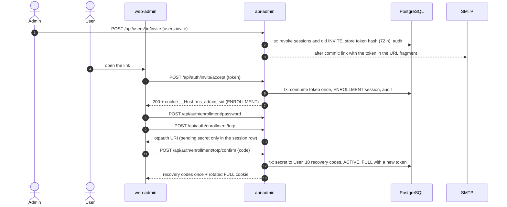
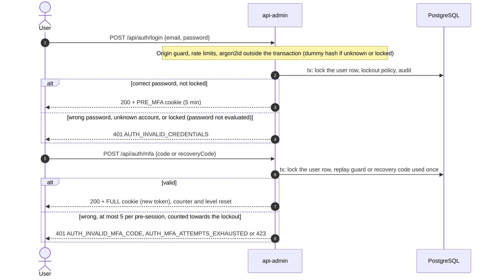
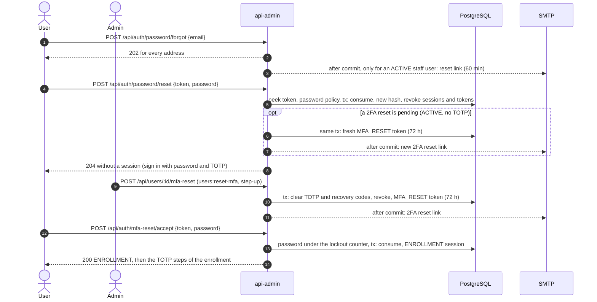
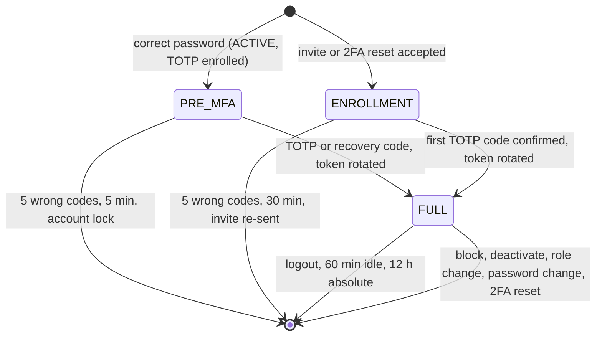
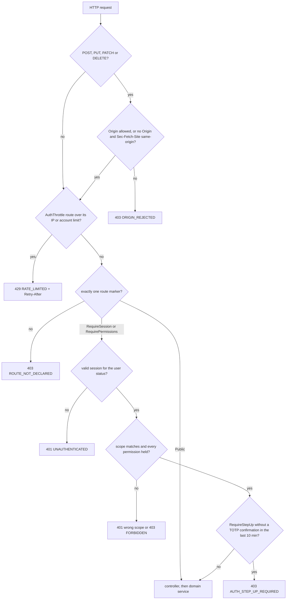

# Phase 2 — Task 23: Documentation — authentication in the architecture docs, README, ADR index

> Part of the phase 2 plan: read [index.md](index.md) (constraints, shared interfaces, env) and this file only.


**Files:**
- Modify: `docs/architecture.md` (sections "Authentication flows — phase 2" and "RBAC and permission sync — phase 3a/3b"), `README.md` (section "Accounts and sign-in", including "Recovering the only admin"), `docs/adr/README.md`, `docs/efficiency/critical-path.md` (strike input D10-6)

**Interfaces:**
- Consumes: every route, rule and ADR of Tasks 08–22, the CLIs `bootstrap:invite` (15) and `admin:reset-mfa` (22); `apps/api-admin/test/route-access.snapshot.json` (source of truth for routes).
- Produces: the maintained description phase 3a and the frontend lanes read first; the reviewed route list the phase 3a RBAC matrix derives from.

- [ ] **Step 1: Write the authentication section of `docs/architecture.md`**

Replace the empty heading `## Authentication flows — phase 2 (sequence diagrams)` with:

````markdown
## Authentication flows — phase 2 (sequence diagrams)

Staff authenticate against `api-admin` only; drivers never do (the kiosk flow is phase 5). The
algorithms live in `@tms/auth-core` (tokens, AES-256-GCM secret cipher, argon2id with a pepper,
password policy, TOTP, recovery codes, lockout, session and step-up policies); the flows live in
`@tms/domain/admin`; controllers only translate HTTP.

### Invite and enrollment



- Action tokens are 32 random bytes; only their sha256 is stored. They are single use (one
  conditional update on `usedAt IS NULL AND expiresAt > now`), consumed only by `POST`, and travel
  in the link's fragment (`#t=`), never in a query string or a log. INVITE and MFA_RESET last 72 h,
  PASSWORD_RESET 60 min; issuing one revokes the user's unused tokens of the same type.
- The TOTP secret is encrypted (`v1.<keyId>.<iv>.<ciphertext>.<tag>`, AAD `totp:<userId>`) and stays
  in `Session.totpPendingSecretEnc` until the first code is confirmed; the confirmed step is stored
  in `totpLastUsedStep`, so the enrollment code cannot be replayed at sign-in.
- Abandoned enrollment: an admin re-sends the invite, which revokes the old token and the
  ENROLLMENT session; accepting again starts without a password or TOTP.

### Sign-in



- Lockout: 5 failures lock the account for 15 min, doubling per consecutive lock up to 1 h
  (`lockoutLevel`). Password, TOTP, recovery code, change password, step-up and the 2FA-reset
  password step share one counter under a row lock; a correct password alone never resets it (only
  a completed second factor or an admin unlock does); attempts while locked are not counted.
- While an account is locked, the public routes (`POST /api/auth/login`, `POST /api/auth/mfa-reset/accept`)
  do not evaluate the password at all: a dummy argon2 hash runs instead (equal work), and the answer
  is the generic 401, byte-identical to a wrong password. The lock stops guessing and tells an
  attacker nothing. 423 `AUTH_ACCOUNT_LOCKED` with `retryAfterSeconds` and `Retry-After` appears only
  where the session already proves the account: the MFA step (PRE_MFA), step-up and change password
  (FULL).
- A wrong password, an unknown email and a disabled or driver account give the same byte-identical
  401; a dummy argon2 hash runs for unknown accounts. Only a correct password on an unlocked account
  learns about a pending 2FA reset (403 `AUTH_MFA_RESET_PENDING`).
- Rate limits apply to `@AuthThrottle` routes only, per client IP (`trust proxy` trusts only the
  proxy) and per account (hashed normalised email, else the session cookie); a 429 carries
  `Retry-After`.

### Password and 2FA resets



- A password reset revokes every unused link, a pending 2FA-reset link included. When the user has a
  2FA reset pending (ACTIVE without an enrolled TOTP), the same transaction issues a fresh 2FA-reset
  link and mails it after commit (audit `auth.password-reset.completed { mfaResetReissued: true }`),
  so a user who also forgot the password is never left with a dead link and a login that only
  answers `AUTH_MFA_RESET_PENDING`.
- The 2FA-reset password step is public: a wrong password counts towards the lockout and answers the
  generic 401 with the link still valid; while locked the password is not evaluated (see Sign-in).

### Recovering the only admin

An admin cannot reset their own 2FA, and a second admin may not exist. When the only ACTIVE admin
has lost both the authenticator and the recovery codes, an operator with shell access to the
deployment runs `pnpm --dir apps/api-admin run admin:reset-mfa <email>` (compose `full` stack:
`pnpm compose --profile full run --rm bootstrap node dist/cli/reset-mfa.js <email>`). It is the
admin 2FA reset issued by the system actor (audit `auth.mfa.reset { via: 'CLI' }`, no actor user):
same lock order, same clearing and revocation, the link is mailed after commit and printed only
outside production or with `--print`. It accepts only an ACTIVE staff user holding the Admin role
(enrolled, or with a reset already pending, which rotates the link); any other email exits 1 with
one masked line and changes nothing. Shell access to the deployment is the trust boundary.

### Session scopes



One `Session` row per sign-in (D4). The cookie `__Host-tms_admin_sid` (HttpOnly, Secure,
SameSite=Strict, Path=/) carries a random token whose sha256 is stored; every scope upgrade rotates
it. Every request re-reads the user (no cache) and applies the status-per-scope rule: FULL and
PRE_MFA need `status = ACTIVE` and an enrolled TOTP, ENROLLMENT accepts INVITED (invite) or ACTIVE
(2FA reset); a session that fails the rule is deleted. Block, deactivate, role change, password
change and 2FA reset delete all the user's sessions and unused tokens in the transaction that makes
the change. A lock ends PRE_MFA sessions only: a lockout never logs the real user out.

### Request pipeline



Three global guards run in this order (ADR 0010): `OriginGuard` (D11, ADR 0003), `ThrottlerGuard`,
`AccessGuard`. Every handler carries exactly one marker — `@Public`, `@RequireSession(scopes)` or
`@RequirePermissions(codes)` (AND, D3) — plus the modifiers `@RequireStepUp` (a TOTP confirmation
of this session within 10 min; a fresh sign-in counts), `@AuthThrottle` and `@SkipSessionTouch`.
`apps/api-admin/test/route-access.snapshot.json` lists every route with its access; the scan test
fails on any route without exactly one marker, and a route missing from the snapshot fails review.

### Admin actions on users

| Action                | Permission          | Step-up    | Revokes sessions and tokens  | Last-admin check |
| --------------------- | ------------------- | ---------- | ---------------------------- | ---------------- |
| Re-send invite        | `users:invite`      | no         | sessions and the old invite  | —                |
| Block / unblock       | `users:block`       | block only | block                        | block            |
| Deactivate (terminal) | `users:deactivate`  | yes        | yes                          | yes              |
| Unlock                | `users:unlock`      | no         | no                           | —                |
| Change role           | `users:assign-role` | yes        | yes                          | demoting an admin |
| Reset 2FA             | `users:reset-mfa`   | yes        | yes                          | —                |
| Send password reset   | `users:update`      | no         | no (the reset itself does)   | —                |

Admin actions never target the actor's own account (403). They take row locks in one order — the
ACTIVE admin rows (`SELECT … FOR NO KEY UPDATE`), then actor and target — and re-check under the
lock that the actor still holds its session, so two admins blocking or demoting each other leave
exactly one ACTIVE admin. Unblocking a user who never enrolled TOTP returns them to INVITED. Mail is
sent only after commit (`UnitOfWork.afterCommit`); a delivery failure never undoes the change and
never logs the link.
````

Insert directly under the heading `## RBAC and permission sync — phase 3a/3b`, above phase 1's `### Permission sync (phase 1)` subsection (phase 1 Task 07 fills this section; the heading stays as it is):

```markdown
Enforcement arrived in phase 2 (ADR 0010): route markers, `AccessGuard` (permissions read from the
database on every request, AND semantics) and the fail-closed route scan. Phase 3a adds `GET /me`
and the RBAC matrix test: expected outcomes are derived from
`apps/api-admin/test/route-access.snapshot.json` × the seeded roles' permissions (per role and
route: allowed or 403) and compared with a reviewed expectations file. "Allowed" means the answer
is neither 401 nor 403, not that it is 2xx: the guards run before the validation pipe, so a probe
without a valid body gets past them and then fails with 422 (or 404 for an unknown id). Phase 3b adds the admin API for
users, roles and permissions on top of the phase 2 user-action services.
```

- [ ] **Step 2: README and ADR index**

`README.md`, a new section after "Quick start" (business language; the first sign-in steps are already there from Task 15):

```markdown
## Accounts and sign-in

- Staff (administrators and operators) sign in to the back office with email, password and a code
  from an authenticator app. There is no self-registration: an administrator invites a user, who
  sets a password (at least 12 characters and hard to guess), connects an authenticator app and
  stores 10 one-time recovery codes.
- Five failed attempts lock the account for 15 minutes; repeated lockouts double up to one hour. An
  administrator can unlock an account at any time.
- Administrators can re-send an invite, block and unblock, deactivate (permanent), change a role,
  reset the authenticator and send a password reset. Sensitive actions ask for a fresh
  authenticator code; nobody can act on their own account, and the last active administrator can
  never be blocked, deactivated or demoted.
- "Forgot password" mails a one-time link valid for 60 minutes; the authenticator is still needed
  to sign in afterwards.
- Drivers do not sign in to the back office; they use the kiosk with their card and PIN (phase 5).

### Recovering the only admin

If the only active administrator has lost both the authenticator app and the recovery codes, someone
with access to the server runs `pnpm --dir apps/api-admin run admin:reset-mfa <their email>` (it
reads `apps/api-admin/.env`; in the compose `full` stack:
`pnpm compose --profile full run --rm bootstrap node dist/cli/reset-mfa.js <their email>`). The
administrator receives a 2FA reset email, confirms the password and connects the authenticator
again. The command works only for an active administrator and changes nothing for any other
address.
```

`docs/adr/README.md`: rewrite phase 1's "Accepted: 0001, 0002, 0004, 0006, 0007, 0008. Planned: 0003 …, 0005 …" sentences so they match `ls docs/adr` after phase 2 — accepted: every numbered file (phase 2 adds 0003 origin, CSRF and session cookies; 0009 API error envelope; 0010 route-access markers and guard pipeline; keep phase 1's 0004, 0006, 0008); planned: only the planned numbers without a file (0005 kiosk device key model).

- [ ] **Step 3: Check diagrams, routes and the ADR index**

Run (render every Mermaid block of the two documents with the pinned CLI; `--no-sandbox` because headless Chromium refuses to start sandboxed in some containers):

````bash
rm -rf /tmp/tms-p2-mmd && mkdir -p /tmp/tms-p2-mmd && echo '{"args":["--no-sandbox"]}' > /tmp/tms-p2-mmd/puppeteer.json
for doc in docs/architecture.md README.md; do
  awk -v out="/tmp/tms-p2-mmd/$(basename "$doc" .md)" '/^```mermaid/{n++; f=sprintf("%s-%02d.mmd", out, n); next} /^```/{f=""; next} f{print > f}' "$doc"
done
for f in /tmp/tms-p2-mmd/*.mmd; do
  pnpm dlx @mermaid-js/mermaid-cli@11.17.0 -p /tmp/tms-p2-mmd/puppeteer.json -i "$f" -o "${f%.mmd}.svg" >/dev/null || echo "FAILED $f"
done
echo "blocks=$(grep -c '^```mermaid' docs/architecture.md README.md | awk -F: '{s+=$2} END {print s}') svgs=$(ls /tmp/tms-p2-mmd/*.svg | wc -l)"
````

Expected: no `FAILED` line; `blocks` equals `svgs`.

Run (every route named in the architecture document exists in the reviewed snapshot):

```bash
grep -oE '(GET|POST|PUT|PATCH|DELETE) /api/[a-z:/-]+' docs/architecture.md | sort -u | while read -r method path; do
  grep -q "\"$method $path\"" apps/api-admin/test/route-access.snapshot.json || echo "not a route: $method $path"
done
for f in docs/adr/0*.md; do n=$(basename "$f" | cut -c1-4); [ "$n" = 0000 ] || grep -q "$n" docs/adr/README.md || echo "ADR $n missing from the index"; done
```

Expected: no output.

In `docs/efficiency/critical-path.md` "Inputs for later phase plans", strike the D10-6 bullet (stack A logs to its own journal, so Task 03 leaves this file alone): `- ~~Phase 2: give \`auth-core\` its own \`no-restricted-imports\` rule~~ — done in phase 2/03 (D10-6).`

- [ ] **Step 4: Verify and commit**

Run: `pnpm exec prettier --write docs/architecture.md README.md docs/adr/README.md docs/efficiency/critical-path.md && pnpm verify`
Expected: green (format check, hygiene).

```bash
git add docs/architecture.md README.md docs/adr/README.md docs/efficiency/critical-path.md
git commit -m "docs: document staff authentication flows, session scopes and the guard pipeline"
```

PR body: diagram — the document's own diagrams (link to the rendered `docs/architecture.md`); boundaries: docs only; verification: Mermaid render output, route and ADR checks, `pnpm verify`; reviewer: `/code-review`.
