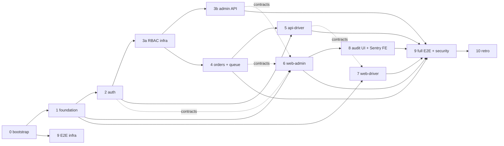

# TMS Platform: RBAC, user administration and driver check-in simulation

Design spec. Status: approved in planning session 2026-09-23, pending review in repository.
Companion documents: `docs/adr/` (decisions), `docs/architecture.md` (maintained technical
documentation), `docs/superpowers/plans/` (per-phase implementation plans).

## 1. Context and goals

The platform replaces an existing terminal management / terminal automation system (TMS/TAS) at
petroleum storage terminals. The roadmap's milestones M2 ("security, users and roles") and M3
("users, roles and permissions", "audit and logging", "base operator UI") plus the "Driver
Check-In" item from the project plan form the first vertical slice. This spec covers that slice:

- RBAC with a permission catalogue, roles administered in the UI.
- User administration: administrators, operators, drivers.
- Invite flow with mandatory TOTP two-factor authentication for staff.
- Card + PIN identification for drivers on a self-service kiosk, on a separate API.
- A minimal FIFO check-in queue so RBAC is demonstrated on real functionality.
- Audit log in the database, structured file logs, Sentry.
- A complete development environment: monorepo, git hooks, CI, Claude Code plugin.

Secondary goal, equally important to the team: learn how to use Claude Code most effectively
(spec → plan → critic → TDD → subagents, skills, hooks, parallel sessions) and document it in a
retrospective with a reusable plugin for future projects.

Reference material (client-provided, kept locally in `docs/client/`, never committed): the
reference system's functional description (sections 3.2.4 personnel, 3.7.1 step 03-04 waiting-room
check-in, 3.9 automatic queue, 3.10.5 gate monitoring with card-swipe simulation, 3.11.1–3.11.5
administration, 5.5 card login for operators), the terminal network architecture drawing (panel PC
and queue display in the waiting room on the isolated TAS network), and the proposal deck (one
shared identity service, a separate login method per application).

## 2. Decisions from the requirements interview

| Topic | Decision |
|---|---|
| Check-in scope | Minimal loading order (driver, vehicle, product, quantity, date). Driver confirms data and an empty tank, enters a FIFO queue and receives a daily sequence number. Operator assigns loading point, calls, completes, removes. No ERP, segments, compartments or assignment algorithm. |
| Driver identification | Card serial (simulated input field, compatible with HID RFID readers) + 6-digit PIN |
| Back-office app | One application for Admin and Operator; menus filtered by permissions |
| Roles v1 | Admin, Operator, Driver; custom roles allowed |
| Permissions | Catalogue in code, synchronised into the database; roles and permissions administered in the UI; permission codes are not created or deleted from the UI; a permission referenced by at least one role cannot be deleted |
| ORM | Prisma |
| Monorepo | pnpm workspaces + Turborepo |
| 2FA | TOTP + 10 recovery codes, mandatory at invite acceptance |
| Email | Nodemailer over SMTP; Mailpit in dev/test |
| Repository | github.com/Stefan-Ethernal/tms-platform, public |
| Client documents | `docs/client/`, gitignored, moved before `git init` |
| UI language | English default; i18next infrastructure from the start (all strings through keys), only the `en` bundle in this phase |
| Audit log | In the database, for auth/admin/check-in events, no undo |
| Deployment (assumption) | Dockerfile + docker-compose behind a reverse proxy; no Kubernetes or redundancy in this phase |
| Ship transport | Out of scope |
| Code quality | SOLID, clean module boundaries, extensible, testable; quality over speed |
| PR verification | Backend: API E2E + unit (+ property tests for invariants). Frontend: Playwright E2E. Claude verifies every change itself and records the outcome in the PR; frontend visually through `claude --chrome`. |
| Process | Disney framework: dreamer at design level, realist + `plan-critic` at spec and per-phase level, measured in the efficiency journal |
| Parallelisation | After phase 3a, up to three Claude sessions in separate worktrees, one per lane |
| Optional tests | axe, k6, Stryker out of scope for the POC |
| Meta-goal | Claude flags deviations from Claude Code best practices; final `RETROSPECTIVE.md`; skills/agents packaged as a reusable plugin |

## 3. Quality principles (apply to all code)

- SOLID: one reason to change per class; services depend on ports (Nest DI tokens), not concrete
  implementations: `MailSender`, `Clock`, `RandomSource`, `PasswordHasher`, `SecretCipher`,
  `TotpProvider`.
- Module boundaries: a Nest module exports only a service facade. Controllers contain no logic.
  **Transactions**: `@nestjs-cls/transactional` with the Prisma adapter. A state change that
  crosses a module boundary (e.g. cancelling an order removes its queue entry) and the audit record
  are **direct service calls inside one transaction**. Domain events (`@nestjs/event-emitter`) are
  for fire-and-forget side effects only (email, Sentry breadcrumb), never for state changes.
- Dependency rule: `contracts ← db ← domain ← apps`. `auth-core` is Nest-free and Prisma-free
  (pure ports and algorithms); adapters live in `domain`. Enforced with `eslint-plugin-boundaries`.
  Additional rule: `apps/api-driver` may import only `@tms/domain/checkin` and `@tms/domain/shared`.
- Enums and statuses are defined once in `contracts` (zod) and mirrored in `schema.prisma`; a unit
  test asserts set equality.
- Testability: time, randomness, mail, cipher and Sentry sit behind ports with in-memory test
  implementations.
- Explicit state machines (allowed-transition tables) for `LoadingOrder` and `QueueEntry`.
- Fail-closed security: a route without `@RequirePermissions` or `@Public` cannot exist (guard + test).

## 4. Decisions locked before phase 1

| # | Question | Decision |
|---|---|---|
| D1 | Staff login identifier | Email. `username` is a human-readable identifier for display/import, not for login. |
| D2 | `LoadingOrder.driverId` | `User.id` (kind DRIVER). |
| D3 | `@RequirePermissions(a, b)` | AND. For OR, define a dedicated permission. |
| D4 | Pre-session (after password, before TOTP) | Same `Session` row with `mfaVerifiedAt = null` and `scope` (`PRE_MFA`, `ENROLLMENT`, `FULL`). |
| D5 | `/health` | `@Public`, no device key, returns only `ok`/`degraded` (no database details). |
| D6 | `GET /me` on api-driver | Does not exist. |
| D7 | Migrations in parallel lanes | One migration per PR; a PR carrying a migration is rebased on `main` and its migration regenerated before merge; such PRs merge serially. |
| D8 | "Arrived" step | Dropped; the transition is CALLED → DONE. |
| D9 | Soft delete of users | None. DEACTIVATED is terminal; no hard delete (audit integrity). |
| D10 | Time zone for the queue "day" | `TERMINAL_TZ` env (Europe/Belgrade); containers run in UTC. |
| D11 | Origin and CSRF | Single origin: reverse proxy (Caddy) in compose serves the SPA and forwards `/api`; Vite `server.proxy` in dev. No CORS with credentials. Cookie `SameSite=Strict` plus a global guard checking `Origin`/`Sec-Fetch-Site` on mutations. ADR-0003. |
| D12 | Who runs migrations | No manual step in either flow. Compose: one-shot `migrate` service (`prisma migrate deploy` + permission sync); apps `depends_on: service_completed_successfully`. Local: `pnpm dev` has a `predev` script running `prisma migrate dev` + sync. Migrations never run inside a Nest process (two processes share the database; a failure must fail clearly as a separate step, not as an app crash loop). |
| D13 | Lock on wrong PIN | Per driver (`DriverProfile`), not per card. |
| D14 | File logs in containers | Enabled by default (requirement); `LOG_DIR` is a volume; `LOG_FILE_ENABLED=false` for environments that collect stdout. |
| D15 | Driver type RAIL | Kept (requirement). Same FIFO flow; the only difference is the loading point `kind` and a UI filter. |

## 5. Approach: two NestJS processes, shared libraries, one database

Alternatives considered: (B) one Nest process with two route prefixes: simpler, but no process or
network isolation. (C) microservices with separate databases: real isolation, excessive complexity
for this phase.

Chosen (A): `api-admin` and `api-driver` are separate deployables sharing the Prisma client,
`contracts`, `auth-core` and `domain` through workspace packages. api-driver imports only
`@tms/domain/checkin` and `@tms/domain/shared` (subpath exports), so administrative Nest modules
are not in its import graph. Note: this is isolation at the level of loaded modules and lint
rules, not a package-level guarantee; the real boundary is the network (the kiosk API is reachable
only from the isolated terminal network).

## 6. Repository structure

```
tms-platform/
  apps/
    api-admin/       NestJS, back-office API (admin + operator), :3001
    api-driver/      NestJS, kiosk API (driver + display), :3002
    web-admin/       React 19 + Vite, back-office SPA
    web-driver/      React 19 + Vite, kiosk SPA (touch, PIN pad, auto-logout) + /display route
  packages/
    contracts/       zod DTO schemas, enums, permission catalogue, audit actions, Sentry scrub list,
                     ListQuerySchema (paging, multi-sort, typed filters)
    db/              Prisma schema, migrations, seed, PrismaService (Nest module)
    auth-core/       pure ports and algorithms: hashing (argon2id + pepper), TOTP with replay guard,
                     tokens, lockout policy, AES-256-GCM cipher; no Nest, no Prisma
    domain/          Nest service-layer modules with subpath exports:
                       ./shared   audit, clock, mail port, transaction host, ListQueryBuilder, CSV streamer
                       ./admin    users, roles, permissions (sync), sessions, tokens, drivers,
                                  cards, carriers, vehicles, products, loading-points, orders-admin
                       ./checkin  identify, driver-orders, confirm, queue, display
    logger/          nestjs-pino configuration, pino-roll file transport, redaction, request-id
    ui/              shared React components (shadcn/ui + Tailwind), theme, i18n init, PIN pad
    config/          shared eslint (with boundaries), tsconfig, prettier, vitest/jest presets
  e2e/               Playwright projects (web-admin, web-driver) + helpers (Mailpit, TOTP, seed API)
  infra/
    docker-compose.yml   postgres:16, mailpit, migrate (one-shot), caddy (reverse proxy, single origin);
                         profile "full" also starts all apps; profile "test" shortens lockout durations
    docker/              Dockerfile per application (multi-stage), Caddyfile
  tools/claude-plugin/ethernal-nest-react/   .claude-plugin/plugin.json, skills/, agents/, hooks/
  .claude/           CLAUDE.md, settings.json (allowlist, plugin-dir)
  .github/           workflows/ci.yml, workflows/e2e.yml, pull_request_template.md, dependabot.yml
  docs/
    client/          gitignored client documents
    superpowers/     specs/, plans/
    adr/             one ADR per decision
    architecture.md  technical documentation (maintained by docs-writer)
    efficiency/      journal per lane → EFFICIENCY.md in the retrospective
    RETROSPECTIVE.md deliverable at the end
```

## 7. Data model (Prisma)

Users and access:
- `User`: id, kind (STAFF | DRIVER), username (unique, display/import), firstName, lastName,
  dateOfBirth?, phone?, email (unique, required for STAFF, optional for DRIVER), status
  (INVITED | ACTIVE | BLOCKED | DEACTIVATED), passwordHash?, totpSecretEnc?, totpKeyId?,
  totpEnabledAt?, totpLastUsedStep? (replay guard), roleId, locale, lastLoginAt?,
  failedLoginCount, lockedUntil?, createdById?, timestamps.
- `DriverProfile` (1:1, kind=DRIVER): driverType (TRUCK | RAIL), carrierId, licenseNumber?,
  adrExpiresAt?, pinHash (argon2id over an HMAC-peppered PIN), pinFailedCount, pinLockedUntil?,
  pinUpdatedAt.
- `IdentityCard`: id, serial (unique), userId (driver), status (ACTIVE | BLOCKED), issuedAt.
  Deviation from the reference system: the card is bound to the driver (we authenticate a person);
  a vehicle card can be added later for gate simulation.
- `Role`: id, name (unique), description, isSystem, appliesTo (STAFF | DRIVER). Assigning a role
  validates `appliesTo === user.kind`.
- `Permission`: code (PK), group, name, description, isDeprecated, syncedAt.
  `RolePermission` (roleId, permissionCode, FK RESTRICT on permission delete).
- `Session`: id, userId, tokenHash, scope (PRE_MFA | ENROLLMENT | FULL), mfaVerifiedAt?,
  totpPendingSecretEnc? (only during enrollment), mfaAttempts, expiresAt, lastSeenAt, ip, userAgent.
- `ActionToken`: id, userId, type (INVITE | PASSWORD_RESET | MFA_RESET), tokenHash, expiresAt,
  usedAt?, createdById.
- `RecoveryCode`: id, userId, codeHash, usedAt?.

Master data (minimal; Products and LoadingPoints are seed-only with a read API, no CRUD UI):
- `Carrier`: id, name, isActive. `Vehicle`: id, registration (unique), carrierId,
  kind (TRUCK | RAIL_WAGON), isBlocked.
- `Product`: id, code, name, isActive. Seeded with the terminal's product codes. A table with a
  foreign key from orders, not an enum: a new product is a row (no migration or deploy), and the
  reference system treats products as master data.
- `LoadingPoint`: id, code, name, kind (TRUCK_ISLAND | RAIL_TRACK), isActive. Seeded with the
  terminal's islands and rail tracks. Same rationale as `Product`.

Operations (deliberately minimal):
- `LoadingOrder`: id, orderNumber (unique), transportKind (TRUCK | RAIL), driverId (User.id),
  vehicleId, carrierId, productId, quantityLiters, plannedDate (DATE), status
  (CREATED | QUEUED | CALLED | LOADED | CANCELLED), notes, createdById, timestamps.
- `QueueEntry`: id, orderId, activeOrderId? (unique; equals orderId while WAITING/CALLED, null
  afterwards), day (DATE in `TERMINAL_TZ`), sequenceNumber, loadingPointId?, status (WAITING |
  CALLED | DONE | REMOVED), checkedInAt, checkedInVia (KIOSK | MANUAL), kioskId?, calledAt?,
  completedAt?, removedById?, removeReason?. Unique (day, sequenceNumber). Queue position is
  **derived** at read time (`ORDER BY checkedInAt, id` over active entries), never stored.
- `QueueDayCounter`: day (DATE PK), next INT. Bumped with `UPDATE ... RETURNING` in the same
  transaction as the entry insert (no race).
- `AuditLog`: id, at, app (ADMIN | DRIVER | SYSTEM), actorUserId?, action (union from
  `contracts`), targetType?, targetId?, outcome (SUCCESS | FAILURE), ip?, userAgent?, metadata
  jsonb (typed allowlist per action; a unit test asserts no forbidden keys). Indexes: at,
  actorUserId, action, (targetType, targetId).

## 8. Authentication

Staff (admin, operator), api-admin:
1. Admin creates a user (name, username, email, role with appliesTo STAFF; email locale is `en`
   while a single bundle exists). Status INVITED, `ActionToken` INVITE (32 random bytes, hash
   stored, 72 h), email with a link to web-admin. **Bootstrap admin** is created by the seed in
   INVITED state; the seed prints the invite URL (and it lands in Mailpit in dev). No password in
   env, no ACTIVE user without TOTP.
2. Acceptance: the token is consumed and an **ENROLLMENT pre-session** issued; the user sets a
   password (min 12 characters, zxcvbn ≥ 3, argon2id), then TOTP: the secret is generated into
   `Session.totpPendingSecretEnc`, the QR shown, the code verified; only then is the secret written
   to `User`, 10 recovery codes shown once, status ACTIVE, session upgraded to FULL. If the user
   abandons midway, recovery is "resend invite".
3. Login: email + password → PRE_MFA session (5 min) → TOTP or recovery code → FULL session.
   Cookie httpOnly, Secure, SameSite=Strict; idle 60 min, absolute 12 h (configurable).
   TOTP: ±1 step window, `totpLastUsedStep` prevents replay, **at most 5 attempts per
   pre-session**, after which the pre-session is destroyed and attempts count towards account
   lockout.
4. Lockout: 5 failed passwords → 15 min, progressive doubling, **capped at 1 h**; the counter
   resets on success and on lock expiry; an admin can unlock (`users:unlock`). Rate limiting per IP
   and per account (@nestjs/throttler) with `trust proxy` configured for Caddy. Every attempt is
   audited.
5. Admin actions: resend invite, block/unblock, deactivate, unlock, reset 2FA (MFA_RESET token →
   after the password the user gets an ENROLLMENT pre-session, not FULL), change role, send password
   reset. Self-service forgotten password via PASSWORD_RESET token.
   **Revocation**: block, deactivate, password change, role change and 2FA reset delete all the
   user's sessions and unused tokens. Every request checks `status = ACTIVE` (no cache).
   **Step-up**: 2FA reset, role change and block require a TOTP confirmation within the last 10 min.
   **Last admin**: "admin" means a user holding the system Admin role; nobody may change their own
   role; any block/deactivate/role change that would leave zero ACTIVE admins is rejected, checked in
   a transaction with `SELECT ... FOR UPDATE`.
6. CSRF and origin: decision D11.
7. Secrets at rest: TOTP secret AES-256-GCM with `SECRETS_ENC_KEY` from env behind the
   `SecretCipher` port, `keyId` for rotation; the PIN is passed through HMAC with `PIN_PEPPER` from
   env before argon2id.

Driver, api-driver:
1. Admin creates a driver: personal data, carrier, type, ADR expiry, card, PIN (6 digits,
   generated and shown once, or entered). No email/password/TOTP. Role Driver (appliesTo DRIVER).
2. Devices: `KIOSK_DEVICES` env (JSON map `deviceId → {keyHash, scope: checkin | display}`).
   Every request carries `X-Device-Id` + `X-Device-Key`; scope `display` may only call
   `GET /display/queue`. The key inside a browser SPA is a device tag and a first hurdle, not a
   secret; the real control is network isolation + PIN lockout (ADR-0005).
3. `POST /checkin/identify {cardSerial, pin}`: eligibility table (also the model for property
   tests): card exists and is ACTIVE; driver is ACTIVE and kind DRIVER; the driver's role has
   `checkin:perform`; ADR not expired (if set); PIN correct. Five failures → `pinLockedUntil`
   15 min (per driver). Success → JWT 5 min, `sub = userId`, `kioskId`, scope `checkin`, own issuer
   and secret.
4. `GET /checkin/orders`: orders where `driverId = sub`, `plannedDate = today (TERMINAL_TZ)`,
   `status = CREATED`, vehicle not blocked. `POST /checkin/orders/:id/confirm {vehicleConfirmed,
   emptyConfirmed}`: asserts `order.driverId === sub` (IDOR test), same `kioskId`, both confirmed
   → in one transaction: bump `QueueDayCounter`, insert `QueueEntry`, order QUEUED, audit. Response:
   sequenceNumber + "follow the display".
5. Kiosk auto-reset after 20 s on the result screen or 60 s idle; the JWT is not renewed.
6. Boundary: api-admin rejects DRIVER users and driver JWTs; api-driver rejects staff cookies. No
   token is valid on the other API (different issuer/secret). E2E-tested in both directions.

## 9. RBAC (catalogue in code, synchronised to the database, administered in the UI)

Source of truth and sync:
- Catalogue in `packages/contracts/src/permissions.ts`: `{ code, group, defaultName,
  defaultDescription, renamedFrom?: string[] }`. Groups: users, roles, permissions, drivers, cards,
  vehicles, carriers, products, loading-points, orders, queue, audit, checkin. Examples:
  `users:read`, `users:create`, `users:update`, `users:block`, `users:unlock`, `users:invite`,
  `users:reset-mfa`, `roles:read`, `roles:manage`, `permissions:read`, `permissions:update`,
  `orders:read`, `orders:manage`, `queue:read`, `queue:assign-point`, `queue:call`,
  `queue:complete`, `queue:remove`, `queue:manual-checkin`, `audit:read`, `checkin:perform`.
- `PermissionSyncService` (run by the `migrate` service, `predev` and the seed, never by the
  app): upserts catalogue codes (does not overwrite admin-edited name/description), `renamedFrom`
  migrates `RolePermission` rows before the old code becomes deprecated, a deprecated code is
  deleted only when no role references it. Idempotent (`sync(sync(c)) == sync(c)`), logs its result.

Roles and administration in the UI:
- Seed: **Admin** (all STAFF permissions, system role, permissions locked), **Operator**
  (orders:*, queue:*, drivers:read, cards:read, vehicles:read, carriers:read, products:read,
  loading-points:read, audit:read), **Driver** (checkin:perform, system role, appliesTo DRIVER).
- Roles: list, create (with appliesTo), edit name/description, permission matrix by group, delete
  only if not system and unused. Changes take effect immediately (the guard reads from the
  database per request; one indexed query).
- Permissions: list by group with search, edit name and description, show roles using each,
  deprecated flag. No creation/deletion of codes in the UI; API delete of a referenced permission → 409.

Enforcement:
- `@RequirePermissions(...codes)` (AND, type `PermissionCode`) + `PermissionsGuard`; `@Public()`
  explicit; a global guard rejects undecorated routes (fail-closed).
- `GET /me` (api-admin) returns the user + effective permissions; FE `usePermissions()`, `<Can>`,
  route guard. The server is the only authority.
- Tests: RBAC matrix **derived** from Nest metadata × seeded roles, compared with a reviewed
  expectations file (fails if a route has no entry); object-level E2E (confirming another driver's
  order, acting on a REMOVED entry, driver JWT on an admin route); review checklist item "does the
  permission name match the action"; catalogue ↔ database after sync; `renamedFrom` flow; deleting a
  referenced permission rejected.

## 10. Check-in and queue (FIFO, operator-managed)

- Check-in (kiosk or manual) creates a `QueueEntry` with a daily sequence number at the end of the
  FIFO queue, without a loading point. One active entry per order (`activeOrderId` unique). A
  REMOVED order can check in again.
- Operator: FIFO list (truck/rail filter), assign/change loading point (`queue:assign-point`, the
  point must match `transportKind`), call (`queue:call`), complete (`queue:complete` → DONE, order
  LOADED), remove with reason (`queue:remove`), manual check-in (`queue:manual-checkin`, the
  equivalent of the reference system's card-swipe simulation). Every action is audited.
- Transitions: order CREATED → QUEUED → CALLED → LOADED; CANCELLED from CREATED/QUEUED/CALLED.
  Entry WAITING → CALLED → DONE; REMOVED from WAITING/CALLED. `OrdersService.cancel` is the single
  owner of the coupled transition and calls `QueueService.remove` in the same transaction.
- Display: `GET /display/queue` (device scope `display`), polling every 5 s: sequence number,
  registration, loading point or "—", colour-coded status.
- Deliberately omitted: automatic assignment, carrier priority, call expiry, auto-call, SSE, queue
  settings.

## 11. Observability

- Logs: nestjs-pino, JSON, stdout + `pino-roll` into `LOG_DIR` (volume; daily; N-day retention;
  one file per application; `LOG_FILE_ENABLED` switch). Request-id via AsyncLocalStorage.
  Redaction: password, pin, cardSerial, token, authorization, cookie, totp, recoveryCode.
  **Introduced in phase 1**, before any auth code.
- Sentry: `@sentry/nestjs` (both APIs), `@sentry/react` (both SPAs). DSN from env, disabled when
  empty; release = git SHA; `sendDefaultPii=false`; `beforeSend` scrub list shared from
  `contracts`; no user context on the kiosk. Source maps uploaded in CI when a token is present.
- Audit: `AuditService.record()` inside the caller's transaction; admin screen with filters
  (user, action, target type, time, outcome) and detail; configurable retention.
- Health: `@nestjs/terminus` `/health` on both APIs (D5).

## 12. Frontend

Shared stack: React 19, Vite, TypeScript strict, React Router, TanStack Query, react-hook-form +
zod from `contracts`, i18next (en default, all strings through keys), shadcn/ui + Tailwind,
TanStack Table, Vitest + Testing Library, MSW for development against contracts before the backend
PR lands.

Design system (`packages/ui`; the FE-admin lane runs a design pass with the `frontend-design`
skill before the first page; the outcome is a short `docs/design-system.md`):
- Modern, intuitive, no "template" feel. Light and dark theme through CSS tokens (shadcn
  convention), user choice + system preference, remembered per user.
- Typography: Inter for UI, JetBrains Mono for codes, registrations, sequence numbers and card
  serials. Scale and spacing defined as tokens.
- States modelled as colour **labels** (`<StatusBadge>`): outlined text coloured by semantics
  (e.g. INVITED blue, ACTIVE green, BLOCKED red, DEACTIVATED grey; WAITING yellow, CALLED blue,
  DONE green, REMOVED grey). One status → colour map in `packages/ui`, derived from the enums in
  `contracts`, contrast checked in both themes.
- The kiosk shares tokens but uses a larger scale and bigger touch targets.

Generic list components (one implementation used by every list in web-admin):
- `<DataTable>` over TanStack Table with **server-side** paging, **multi-sort** (shift+click,
  order shown as a number) and **inline per-column filtering** with operators by data type:
  string (contains, equals, startsWith, isEmpty), number (=, ≠, >, ≥, <, ≤, between), date (on,
  before, after, between), enum (in), boolean (is). Table state (page, sort, filters) lives in the
  URL so links are shareable and survive refresh. Column chooser, empty state, skeleton, error with
  retry.
- **CSV export** of the filtered and sorted set (not only the current page): the button calls the
  same list endpoint with `format=csv`; the server streams CSV with the same columns, with a row
  limit and an audit record (`*:export` is the same permission as `*:read`).
- Backend counterpart: `ListQuerySchema` in `contracts` (page, pageSize ≤ 200, sort[], filter[])
  and `ListQueryBuilder` in `domain/shared` that turns the query into Prisma `where`/`orderBy` over
  **explicitly whitelisted columns** per entity (with type), so foreign or sensitive columns can be
  neither filtered nor sorted. Response `{ items, page, pageSize, total }`. Every list endpoint
  (`GET /users`, `/roles`, `/drivers`, `/orders`, `/audit`...) uses the same pair; the
  `new-admin-page` skill generates both ends.
- Generic forms: `<FormField>` wrappers over react-hook-form + the zod schema from `contracts`,
  per-field errors, server errors (409 unique, 422 validation) mapped onto fields.

Input validation (every CRUD): the same zod schema from `contracts` validates on the client (form,
before submit) and on the server (global `ZodValidationPipe`, no route without a DTO schema). The
server is the authority: 422 with a list of fields and messages, 409 for unique conflicts with the
field name. Business validation rules (e.g. loading point must match the order's transport kind,
role must match the user's kind) live in services and return typed domain errors mapped to HTTP.

web-admin screens: login (password → TOTP/recovery), accept-invite wizard (password → QR →
recovery codes), password reset; Users, Roles, Permissions, Drivers, Carriers, Vehicles, Products
(read-only), Loading points (read-only), Orders, Audit log: all as `<DataTable>` lists with a
detail/form (create/edit where CRUD exists) and permission-gated actions (invite/resend, block,
unlock, 2FA reset with step-up, PIN reset, manual check-in, role permission matrix); Queue (FIFO
list with assign point, call, complete, remove); My account (password, regenerate recovery codes,
theme).

web-driver: kiosk mode without navigation. Screens: card (autofocus, accepts HID input + Enter) →
PIN pad → order choice (if more than one) → data confirmation + "tank is empty" → result (sequence
number) 20 s → reset. Idle 60 s. `/display`: queue monitor, large type, auto-refresh.

## 13. Testing and per-PR verification

Pyramid:
- Unit (Jest backend, Vitest frontend): all logic; services, guards, TOTP/PIN/lockout, state
  machines, `ListQueryBuilder` (whitelist, typed operators, rejection of disallowed columns),
  `<DataTable>` (filters, sort, URL state), `<StatusBadge>` map complete for every enum.
- Property (fast-check), **model-based**: random command sequences over the queue and state
  machines never reach an invalid state, a rejected command leaves state unchanged, daily sequence
  numbers strictly increase without duplicates under concurrent check-in; lockout counter monotonic
  under arbitrary sequences; `sync(sync(c)) == sync(c)` and role assignments preserved for any
  catalogue diff; identify eligibility table over random state combinations.
- API E2E (Jest + supertest + **Testcontainers Postgres everywhere**, one database per Jest worker
  from a template): **primary backend verification.** Every endpoint over HTTP with real guards;
  complete auth flows including abandoned enrollment; RBAC matrix; object-level; app boundary in both
  directions; session revocation.
- UI E2E (Playwright against the compose `test` profile with shortened lockout durations):
  **primary frontend verification.** Unique users/cards per test; Mailpit helper with a `to:` filter
  and timeout; TOTP through otplib waiting for the next step after a code is used. Scenario: admin
  invites operator → accepts → creates driver, vehicle, order → kiosk check-in → queue → operator
  assigns point, calls, completes. Negative: 5× PIN → lock; blocked user; no permission → no menu
  and 403. Trace + screenshot on failure as CI artefacts.
- Security: brute force (password, TOTP, PIN), rate limit, Origin guard, cookie attributes, token
  reuse, TOTP replay, device key scope, IDOR.
- CI: `prisma migrate diff` (drift), `tsc --noEmit`, eslint with boundaries, build, gitleaks,
  check that no `*.pdf|*.pptx|*.docx` exists outside `docs/client/`.

Protocol for every PR:
1. Feature branch, conventional commits, PR to `main`, focused on one boundary.
2. TDD; the PR description names the pyramid layer.
3. `pnpm verify` green locally; Playwright for frontend changes. Claude performs the verification
   itself and records the outcome (not "what should be checked" but "what was checked and how it
   went").
4. Frontend visually: `claude --chrome` (Claude in Chrome v1.0.36+, Linux supported, `/login` with an
   Anthropic account), the flow exercised in a real tab, screenshots in the PR.
5. A PR touching auth/RBAC/sessions/tokens: `security-reviewer` mandatory; others `/code-review`.
6. CI green; merge after review.

PR description (`.github/pull_request_template.md`, filled by the `pr` skill):
- **What and why**: 2–4 sentences.
- **Diagram** (Mermaid when it explains better than text): sequence, flowchart, erDiagram, block.
- **Affected boundaries**: packages/apps, public interfaces, migration (yes/no, reversible).
- **Verification plan**: what will be run — `pnpm verify`, the scenarios and CI jobs, and for
  frontend changes the `claude --chrome` steps planned.
- **Verification results**: backend table `scenario | layer | outcome` with actual results;
  frontend steps executed in `claude --chrome` + 2–4 screenshots.
- **Risks and notes**: uncovered areas, follow-ups, ADR candidates.

Out of scope for the POC: axe, k6, Stryker.

## 14. Development environment and Claude Code setup

- Git hooks (husky): pre-commit lint-staged + gitleaks; commit-msg commitlint; pre-push
  `turbo run typecheck test --filter=...[origin/main]`. Gitleaks also in CI (hooks can be bypassed).
- CI (GitHub Actions): lint, typecheck, unit, property, API E2E (Testcontainers), build, drift,
  hygiene checks; E2E workflow with compose; Dependabot.
- docker-compose: postgres, mailpit, migrate (one-shot), caddy; profiles `full` and `test`.
  `.env.example` per application; all secrets only in env.
- **Plugin** `tools/claude-plugin/ethernal-nest-react/` (`.claude-plugin/plugin.json`,
  `skills/<name>/SKILL.md`, `agents/`, `hooks/hooks.json`), loaded with
  `claude --plugin-dir tools/claude-plugin/ethernal-nest-react`, validated with
  `claude plugin validate`; publishable as a private marketplace at the end of the POC. Contents:
  - skills: `new-module`, `add-permission`, `db-migration`, `new-admin-page`, `e2e-scenario`,
    `verify`, `pr`, `docs-sync`.
  - agents: `security-reviewer`, `qa-e2e`, `architecture-reviewer` (SOLID, boundaries, dependency
    rule), `docs-writer`, `plan-critic`.
  - hooks: `PostToolUse` (`Edit|Write`, `*.ts`/`*.tsx`) → eslint --fix + prettier on the file;
    `PreToolUse` blocks (exit 2) edits to `.env`, `.env.*` except `*.example`, and `docs/client/**`;
    `Stop` reminds about `pnpm verify` when `apps/` or `packages/` have changes.
- Project `.claude/settings.json`: allowlist for pnpm/turbo/docker compose/gh read commands.
- **CLAUDE.md** kept short: stack, commands, where things live, rules (TDD; controllers only in
  apps; every route decorated; audit inside the transaction; i18n keys; enums in contracts), a
  "Working agreement" with the rule that Claude flags deviations from Claude Code best practices
  (verification with a checkable criterion; plan mode for anything beyond a small fix; `@`
  references and existing patterns in prompts; CLAUDE.md only for what code does not show; hooks for
  deterministic actions, skills for repeatable flows; interview before large features; `/clear`
  between unrelated tasks and after two failed corrections; subagents for research; `claude -p` for
  CI; parallel sessions with worktrees).
- Documentation (maintained by `docs-writer`, checked in PRs): **business** in README (roles,
  step-by-step use cases, screenshots, how to run, glossary); **technical** in
  `docs/architecture.md` + `docs/adr/` (C4 context/containers in Mermaid, dependency rule, ERD from
  the Prisma schema, sequence diagrams of auth flows, state machines, RBAC sync, observability,
  testing, deployment). ADRs: 0001 two processes, 0002 Prisma, 0003 origin/CSRF/sessions, 0004
  permission catalogue + sync, 0005 kiosk device key model, 0006 transactions and events.
- `docs/efficiency/<lane>.md`: per task: description, approach, start, end, rework, critic findings
  (count, accepted, rework prevented). Merged into `EFFICIENCY.md` in the retrospective.
- `docs/RETROSPECTIVE.md`: what went well, room for improvement, which agents and skills were used
  and how, which were built and how to reuse them, recommendations for the next project.

## 15. Working process: Disney framework (dreamer → realist → critic), adopted

- Design: dreamer = several approaches (A/B/C for the API split, A/B for permissions); realist =
  design sections; critic = `plan-critic` in a fresh context (run over this spec, see below).
- Per phase: `writing-plans` (realist) → `plan-critic` → `subagent-driven-development`. The
  dreamer only when a phase opens new design space (kiosk UX).
- Code: `security-reviewer`, `architecture-reviewer`, `/code-review`.
- Measurement: per critic pass, number of findings, accepted, rework prevented.

### Critic pass over this spec: 25 findings, 23 accepted, 2 partially, 0 rejected

| # | Severity | Finding (abridged) | Decision |
|---|---|---|---|
| 1 | HIGH | TOTP without attempt limit or replay protection | Accepted: 5 attempts per pre-session, `totpLastUsedStep` |
| 2 | HIGH | Bootstrap admin and MFA reset yield ACTIVE without TOTP | Accepted: seed creates INVITED admin + invite URL; ENROLLMENT pre-session |
| 3 | HIGH | Race on sequence number, stored position, time zone | Accepted: `QueueDayCounter`, derived position, `TERMINAL_TZ` |
| 4 | HIGH | Unique `orderId` blocks re-check-in; nobody owns entry removal on cancel | Accepted: `activeOrderId`, `OrdersService.cancel` as owner |
| 5 | HIGH | No transaction design across module boundaries | Accepted: `@nestjs-cls/transactional`, events fire-and-forget only |
| 6 | HIGH | Logger, redaction, audit, contracts too late in phasing | Accepted: all in phase 1 |
| 7 | HIGH | Scope: rail, priority, vehicle ADR, 4 CRUD modules, settings contradiction | **Partial**: RAIL kept (requirement, same flow); priority, vehicle ADR, licenseExpiresAt, adrCertificateNumber, settings dropped; Products/LoadingPoints read-only |
| 8 | MEDIUM | Session revocation, permission cache, long sessions | Accepted: revocation, no cache, idle 60 min / 12 h, step-up |
| 9 | MEDIUM | Accept-invite without an intermediate state | Accepted: ENROLLMENT pre-session, pending TOTP secret in the session |
| 10 | MEDIUM | Lockout DoS, reset semantics, trust proxy | Accepted: 1 h cap, reset rules, `users:unlock`, trust proxy |
| 11 | MEDIUM | Last admin: role change, self-demotion, concurrency | Accepted |
| 12 | MEDIUM | CSRF/CORS/origin undefined | Accepted: D11 |
| 13 | MEDIUM | username vs email; deletedAt | Accepted: D1, D9 |
| 14 | MEDIUM | `domain` as one package contradicts isolation claim | Accepted: subpath exports + boundaries rule; claim softened |
| 15 | MEDIUM | Duplicate enums; auth-core with Prisma | Accepted |
| 16 | MEDIUM | Eligibility table, `Role.appliesTo`, IDOR | Accepted |
| 17 | MEDIUM | Encryption and pepper undefined | Accepted: AES-256-GCM + keyId, HMAC pepper |
| 18 | MEDIUM | Kiosk key semantics, display with identify rights | Accepted: device map with scope, `kioskId` in JWT, D13 |
| 19 | MEDIUM | RBAC matrix misses object-level authorisation | Accepted |
| 20 | MEDIUM | Two database stories in tests, flakiness | Accepted: Testcontainers everywhere, test profile, unique data |
| 21 | MEDIUM | Some property tests are not invariants | Accepted: model-based |
| 22 | MEDIUM | Sync at startup, who runs migrations, rename | Accepted: D12, `renamedFrom` |
| 23 | MEDIUM | Hook blocks `.env.example`; gitleaks bypassable; files before `git init` | Accepted |
| 24 | MEDIUM | Seven ambiguities | Accepted: table D1–D15 |
| 25 | LOW | File transport in containers, Sentry PII, email locale, audit metadata | **Partial**: file logs stay on by default (requirement) with volume and switch; rest accepted |

## 16. Delivery outline and parallelisation

Phases (each TDD, each ends with green CI):

0. Bootstrap: `docs/client/` + `.gitignore` **before** `git init`; GitHub repo; monorepo; tooling;
   compose (postgres, mailpit, migrate, caddy); CI with hygiene checks; hooks; plugin skeleton;
   CLAUDE.md; PR template; Playwright/MSW skeleton; `main.ts`/`app.module.ts` of both APIs with
   reserved slots for logger/Sentry; `claude --chrome` check; efficiency journal started.
1. Foundation: `contracts` (enums, permission catalogue, audit actions, scrub list), `db` (schema,
   migrations, seed with INVITED bootstrap admin), `logger` (redaction, request-id, pino-roll),
   `domain/shared` (AuditService, transaction host, Clock, MailSender port), Sentry no-op wiring,
   `/health`, `migrate` service with permission sync.
2. `auth-core` + api-admin auth: invite, ENROLLMENT/PRE_MFA/FULL sessions, TOTP with replay guard,
   lockout, reset flows, revocation, step-up, last admin, Origin guard.
3a. RBAC infrastructure: decorators, guard, fail-closed, `/me`, matrix test skeleton.
3b. Admin API: users, roles, permissions, drivers, cards, carriers, vehicles, products (read),
    loading-points (read).
4. `domain/checkin` orders + FIFO queue + api-admin operator endpoints.
5. api-driver: device keys, identify, orders, confirm, display feed, app boundary.
6. web-admin.
7. web-driver (kiosk + display).
8. Audit screen in web-admin, Sentry in the SPAs, Sentry release upload, rotation tuning.
9. Full E2E scenarios, security tests, hardening, README/architecture/ADR finalisation.
10. Retrospective: `RETROSPECTIVE.md`, plugin extraction, recommendations.



Critical path (one session, serial): 0 → 1 → 2 → 3a. After 3a the owner opens up to three Claude
sessions, each in its own git worktree (`superpowers:using-git-worktrees`), one per lane. Each
session receives the spec, its phase plan (after a `plan-critic` pass), CLAUDE.md and the file
ownership table.

| Lane | Content | Starts after | Touches |
|---|---|---|---|
| Critical path | 0, 1, 2, 3a | — | everything (only active lane) |
| BE-admin | 3b | 3a | `packages/domain/src/admin/**`, `apps/api-admin/src/admin/**`, `contracts/src/admin/**` |
| BE-ops | 4 → 5 | 3a | `packages/domain/src/checkin/**`, `apps/api-admin/src/ops/**`, `apps/api-driver/**`, `contracts/src/checkin/**` |
| FE-admin | 6 → 8 | 1 (+ contracts per phase) | `apps/web-admin/**`, `packages/ui/**` |
| FE-kiosk | 7 | 1 (+ contracts 5) | `apps/web-driver/**` |
| QA | 9 infra from 0; scenarios as lanes land | 0 | `e2e/**`, `.github/workflows/e2e.yml` |

Rules: **contract-first** (a backend lane first merges a small PR with zod schemas; the frontend
works against them with MSW; before a frontend PR merges, its E2E must pass against the real API);
file ownership per lane (`packages/ui` belongs to FE-admin, FE-kiosk only consumes it; someone
else's file is changed in a separate small PR); rebase on `main` before a PR; migrations per D7; at
most three active lanes. Estimate: one third to one half shorter than serial, verified in the
retrospective from the journal.

## 17. End-to-end verification

1. `docker compose up -d` (postgres, mailpit, migrate, caddy) → migrations and permission sync done.
2. `pnpm dev` (predev runs migrations and sync automatically) → api-admin :3001, api-driver :3002,
   web-admin and web-driver through the Vite proxy on one origin (prod: Caddy).
3. The seed prints the bootstrap admin's invite URL → acceptance: password → TOTP → recovery codes
   → signed in. Abandoning mid-enrollment then "resend invite" works.
4. Admin creates an operator → Mailpit shows the invite → operator completes enrollment → signs in
   with password + TOTP → creates a driver (card + PIN), carrier, vehicle, order for today.
5. Kiosk (device key scope checkin): card → PIN → confirm → sequence number; `/display` (device key
   scope display) shows the queue; display key on identify → 403.
6. Operator: assign point, call, complete → order LOADED; cancelling a QUEUED order removes its
   entry; the audit log shows every step with actor and outcome.
7. Negative: 5× wrong PIN → 15 min lock; 5× wrong TOTP → pre-session destroyed; replayed TOTP code
   rejected; driver JWT on api-admin → 401; staff cookie on api-driver → 401; mutation with a foreign
   Origin → 403; blocking a user ends their active session; the last admin cannot be blocked or
   demoted; an undecorated route fails the test; confirming another driver's order → 403.
8. Two concurrent check-ins receive different sequence numbers (property + API test).
9. `pnpm verify` and `pnpm e2e` green locally and in CI; the CI hygiene check fails if a PDF is
   found outside `docs/client/`.
10. Logs in `LOG_DIR/api-admin.log` rotate and contain no PIN/password/token; Sentry receives a
    test event when a DSN is set, without PII.
